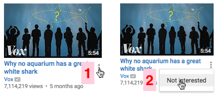

# not-interested
#### Easy way to tell Youtube that this video is not interesting to you!

### Before, 2 steps

### After, One click

## Install
1. Download extension file from https://github.com/gurinderhans/not-interested/blob/master/install_files/not-interested.crx?raw=true

2. Go to `chrome://extensions`.

3. Drop file onto page

4. Click `Add Extension` button.
